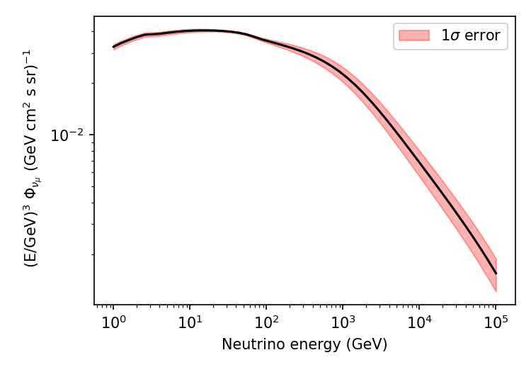

# daemonflux: DAta-drivEn and MuOn-calibrated Neutrino flux

Daemonflux is a tabulated/splined version of the an atmospheric flux model calibrated on muon spectrometer data. For the details about how daemonflux is built and calibrated to muon data [the following publication](https://inspirehep.net/literature/2637710).

```
@article{Yanez:2023lsy,
    author = "Ya\~nez, Juan Pablo and Fedynitch, Anatoli",
    title = "{daemonflux: DAta-drivEn MuOn-calibrated Neutrino Flux}",
    eprint = "2303.00022",
    archivePrefix = "arXiv",
    primaryClass = "hep-ph",
    month = "2",
    year = "2023"
}
```

## Requirements
 * `Python > 3.7`, `numpy`, `scipy`
 * `matplotlib` for examples

## Installation
a) From PyPi: 
    
    pip install daemonflux
    
b) From source in editable mode, so the package gets updated after each `git pull`:
```bash
$ git clone https://github.com/mceq-project/daemonflux
$ cd daemonflux
$ python3 -m pip install -e .
```

## Quickstart

To see more features and a detailed example, refer to the [example](examples/example.ipynb) notebook. In summary, the process of calculating calibrated fluxes from the provided tables is as follows:

    from daemonflux import Flux
    import numpy as np
    import matplotlib.pyplot as plt

    daemonflux = Flux(location='generic')
    egrid = np.logspace(0,5) # Energy in GeV

    fl = daemonflux.flux(egrid, '15', 'numuflux')
    err = daemonflux.error(egrid, '15', 'numuflux')
    plt.loglog(egrid, fl, color='k')
    plt.fill_between(egrid, fl + err, fl - err,
        color='r', alpha=.3, label=r'1$\sigma$ error')
    ...

Resulting in the following figure:




## Explanation of quantities and units

For **neutrinos**, the methods `Flux.flux` and `Flux.error` return values in the units of $(E/\text{GeV})^3/(\text{GeV }\text{s }\text{sr }\text{cm}^2)$, i.e. multiplied by $E^3$. For **muon quantities** are reported as a function of total momentum instead of energy, i.e. the units are  $(p/\text{(GeV/c)})^3/(\text{(GeV/c) } \text{s }\text{sr }\text{cm}^2)$. Natural units $\hbar=c=1$ are used everywhere.

The quantities are: 

- muons: `muflux`, `muratio`, `mu+`, `mu-`,
- muon neutrinos: `numuflux`, `numuratio`, `numu`, `antinumu`, `flavorratio`
- electron neutrinos: `nueflux`, `nueratio`, `nue`, `antinue`, `flavorratio`

Those titled XXXflux are the sum of particle and antiparticle fluxes `numuflux = numu + antinumu`, the ratio is `numuratio = numu/antinumu`, and the is defined as `flavorratio = (numu + antinumu)/(nue + antinue)`.

The `total_` quantities, such as `total_muflux`, represent the total flux, which includes both conventional and prompt atmospheric fluxes. However, unlike the conventional flux, the prompt flux is not calibrated using the daemonflux method, as surface muons are not sensitive to prompt fluxes. As a result, the prompt component does not include correction parameters or errors. It is important to note, however, that the conventional part of the flux remains calibrated, so the total_ flux is simply the sum of the calibrated conventional and uncalibrated prompt fluxes.

## Using parameter correlations represented by the covariance matrix

The parameters of the model are correlated. These correlations are drdetermined from the data we have used for the fit. The errors are already computed taking the covariance matrix into account when using the `error` method. If daemonflux is used in a fit with free floating parameters, one can include these correlations by adding the chi2 as additional penalty term. The chi2 for the current combination of parameters can be obtained by calling `flux.chi2({dictionary of modified parameters})`.

## LICENSE

[BSD 3-Clause License](LICENSE)
